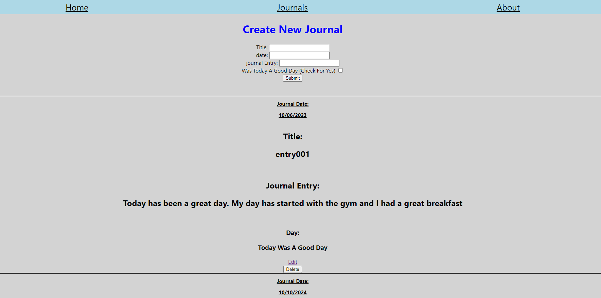
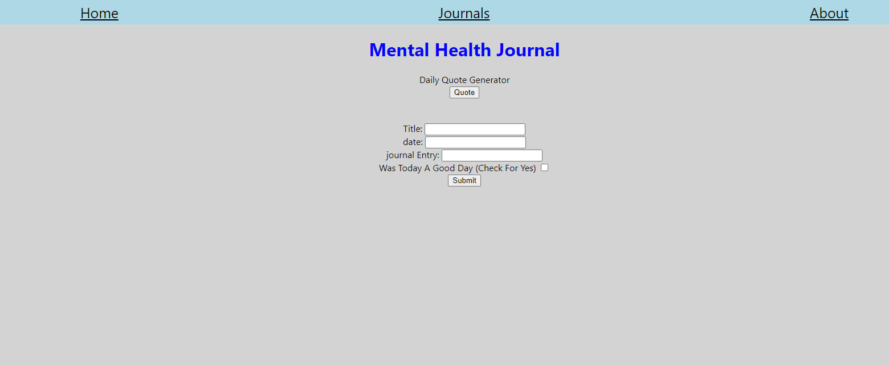
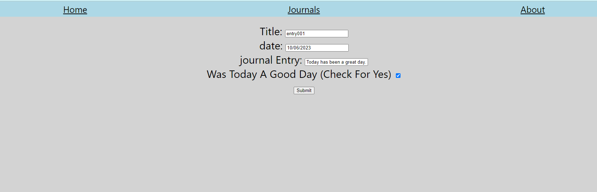

Introduction: A paragraph used to introduce interested parties to the project and needs to include one or more screenshots.
Technologies Used: A list of all technologies, libraries, APIs, etc. used in the project.
Getting Started: Links to the project's planning (Trello board) and the deployed app.
Unsolved Problems: List any unsolved issues.
Future Enhancements: Identify future features and enhancements planned for the project.

# Introduction: 
This Journal Application is an application created to track daily thoughts. It can be used to see and log previous thoughts and feelings as well as have an inspirational quote

Journals Page</img>
 Home Page </img>
Edit Page</img>

## Technologies Used
Technologies Used to create the Mental Health Journal include:
React
Node.js
Express
MongoDB
JavaScript
HTML/CSS

# Getting Started
Deployed Links:
https://mhjounal-frontend.onrender.com
https://mhjounal-backend.onrender.com

### Unsolved Problems
One issue with uploading photos/videos. Would like to further investigate how to do so.

### Future Enhancements
* Adding feature to upload photos and videos
* Changing of the Front End Design
* Adding the Rate system. To rate day 1-10
* More flushed out Home Page
* More of a twitter/X look with date at bottom

